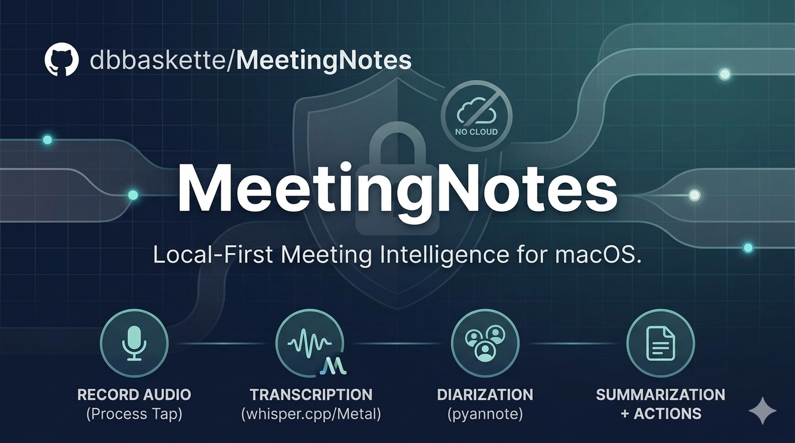
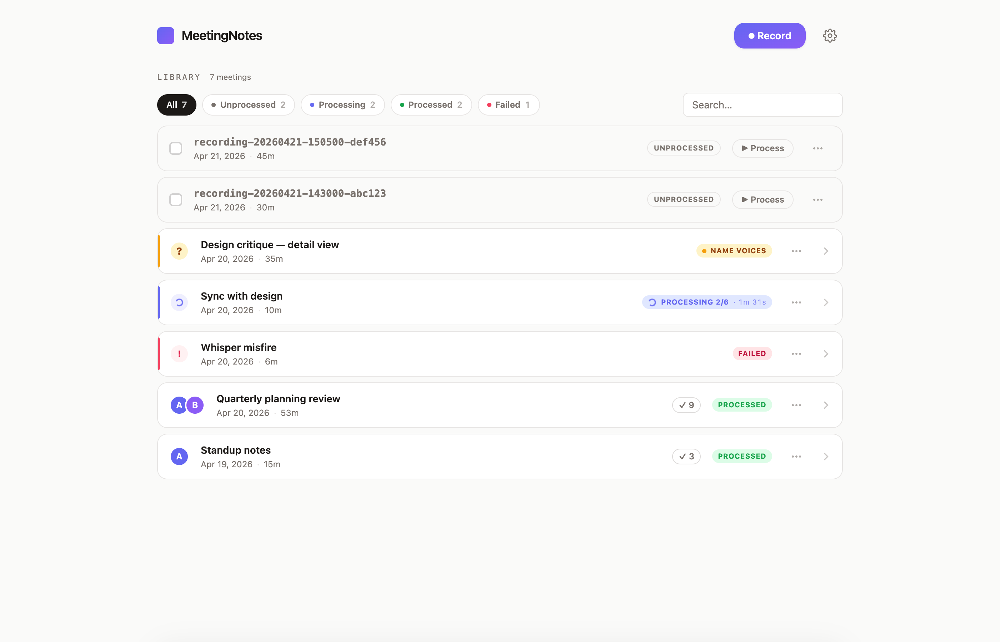
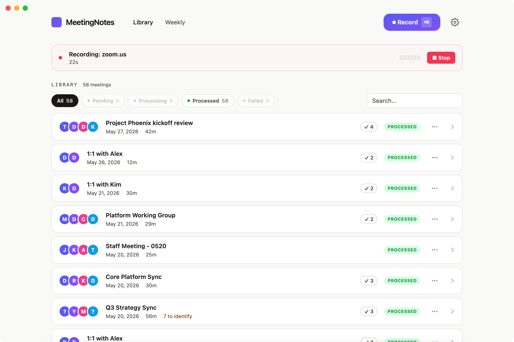
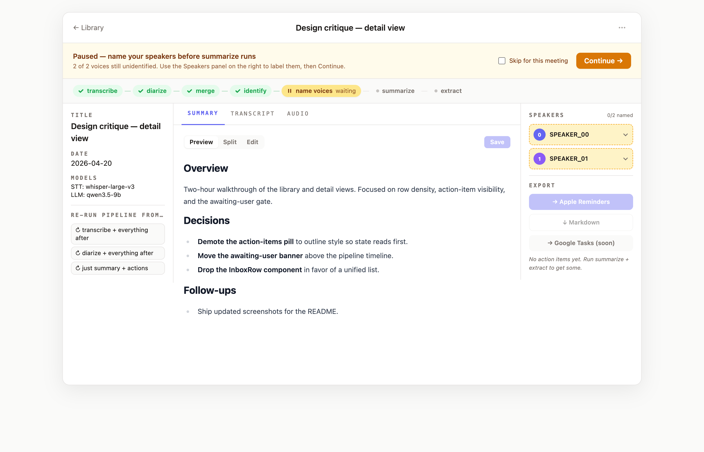
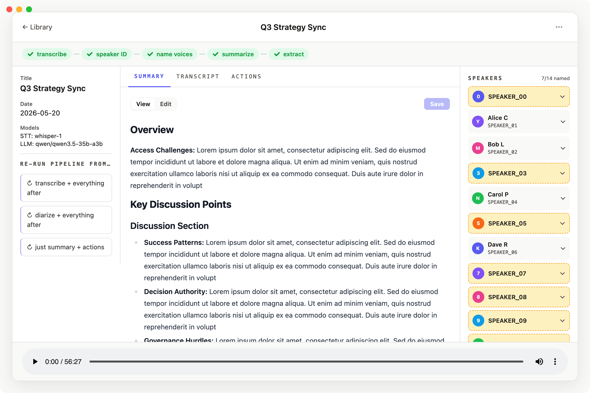
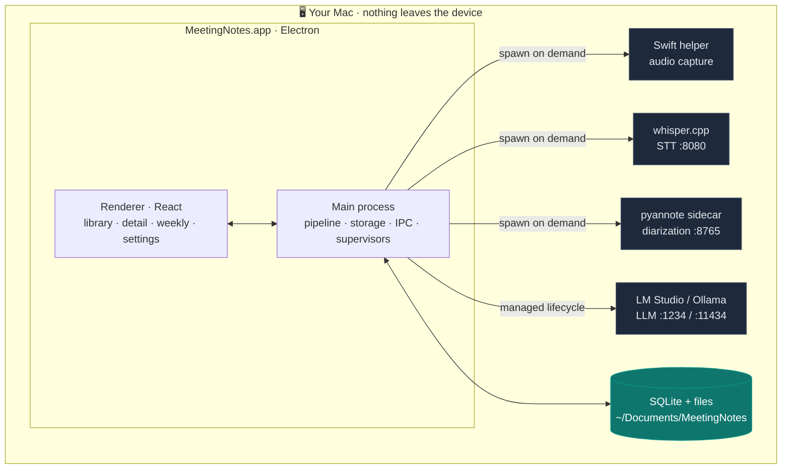
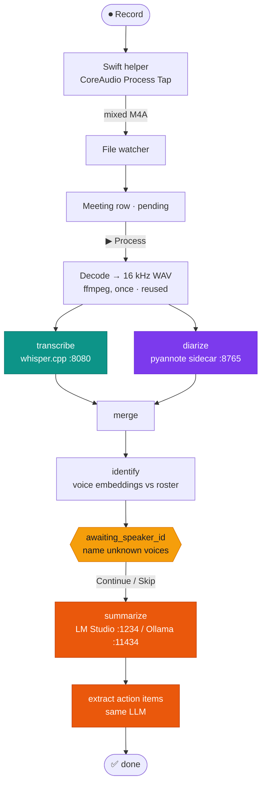

<div align="center">



<h1>MeetingNotes</h1>

<p><strong>Record, transcribe, diarize, summarize, and extract action items from any meeting — entirely on your Mac.</strong><br/>
No cloud. No uploads. No API keys at inference time. No third-party recorder to install.</p>

[](https://support.apple.com/en-us/HT201260)
[](https://support.apple.com/en-us/HT211814)
[](#-status)
[](LICENSE)
[](https://www.electronjs.org/)
[](https://www.typescriptlang.org/)
[](#-privacy--security)
[](https://dbbaskette.github.io/MeetingNotes/)

</div>

---

> [!NOTE]
> **Everything runs on your machine.** Audio never leaves the device — capture, speech-to-text, speaker diarization, and the LLM summary all happen locally. You bring the models; MeetingNotes orchestrates the rest.

## ✨ What it does

<table>
<tr>
<td width="33%" valign="top">

### 🎙️ Capture
One click records **any app's audio** (Zoom, Teams, FaceTime, Slack…) mixed with your mic, via the macOS 14.2 CoreAudio Process Tap — no virtual audio device, no separate recorder.

</td>
<td width="33%" valign="top">

### 🧠 Understand
Local **whisper.cpp** transcription + **pyannote** diarization, then a local LLM writes a structured summary and pulls out committed action items with owners and due dates.

</td>
<td width="33%" valign="top">

### 🗂️ Organize
Name voices once and they're recognized across meetings. A **Needs attention** panel gathers recovery, failure, speaker-review, and pending work, while **Weekly** stitches the week into a narrative with cross-meeting themes and your open action items.

</td>
</tr>
<tr>
<td valign="top">

### 🔗 Trigger anywhere
Auto-detect meetings in browsers and native apps, or fire `meetingnotes://record` from a Shortcut, Stream Deck, or calendar hook.

</td>
<td valign="top">

### 📤 Export
Push action items to **Apple Reminders**, **Google Tasks**, or **Google Docs**; the summary to **Markdown**; or a JSON payload to any **webhook** (n8n, Zapier, Slack…).

</td>
<td valign="top">

### 🔒 Private by design
No SaaS, no telemetry, no API keys. Sandboxed Electron, zod-validated IPC, gated-model licenses cached offline. Your meetings stay yours.

</td>
</tr>
</table>

## 📸 Screenshots

| Library | Recording in progress |
| :---: | :---: |
|  |  |
| **Speaker-ID gate** | **Summary + action items** |
|  |  |

## 🏗️ Architecture

MeetingNotes is an Electron app that orchestrates four local services, spawning each on demand and shutting them down when idle to keep RAM free.



## ⚙️ How the pipeline works

Hit **Record**, and a Swift helper captures the chosen app + mic into a mixed M4A. Click **Process**, and each meeting flows through these stages. `transcribe` and `diarize` run in parallel; everything else is sequential.



Each meeting is one row in SQLite (`~/Documents/MeetingNotes/db.sqlite`) and one folder under `meetings/<slug>/`:

```
meetings/<slug>/
├── audio.mp3            symlink to the recording
├── transcript.raw.json  whisper output
├── diarization.json     pyannote speaker turns
├── transcript.md        speaker-labeled, with real names after the gate
├── summary.md           structured markdown (editable in-app)
└── action-items.json    { text, owner, due_date, source_quote }
```

> [!TIP]
> **Crash-safe.** If the app dies mid-pipeline, `status='processing'` meetings resume on next launch; `status='failed'` waits for an explicit **Retry**, which re-runs from the last safe checkpoint.

## 🚀 Quick start

> [!IMPORTANT]
> **Requirements:** macOS 14.2 (Sonoma)+ on Apple Silicon · ~16 GB RAM · an LLM runtime ([LM Studio](https://lmstudio.ai) or [Ollama](https://ollama.com)) with a chat model · a free Hugging Face account with three pyannote licenses accepted (one-time — see below).

```bash
git clone https://github.com/dbbaskette/MeetingNotes.git
cd MeetingNotes

brew install whisper-cpp ffmpeg

./scripts/setup.sh      # one interactive setup: deps · sidecar venv · model · HF token · .app build
./scripts/start.sh      # launch the packaged .app  (use --dev for hot-reload)
```

`start.sh` exports the HF token, health-checks the stack, and opens the app. **whisper-server, the diarization sidecar, and the LLM runtime are spawned by the app itself on demand** (first transcription wakes whisper, first summarize wakes the LLM and auto-loads the model) and shut down after 10 minutes idle.

**First launch** runs a **five-step wizard** — macOS permissions → Whisper model → Hugging Face token → LLM runtime → transcription server — each step skippable, each verified live (the LLM step even runs a quick loop-detection canary on your chosen model). macOS prompts for **Microphone** and **Screen & System Audio Recording** on first record; grant both.

## 🎬 Recording a meeting

1. Click **⏺ Record** — or fire `meetingnotes://record?source=zoom.us` from a Shortcut / `osascript` / Stream Deck — or let auto-detect catch it (an in-library banner appears when a known meeting URL opens in your browser, or when Zoom / Teams / Webex / FaceTime starts a call).
2. The **source picker** lists every app currently making sound; recognized meeting apps float to the top with a `MEETING` badge. Pick one, or **All system audio** as a catch-all.
3. A **live recording row** appears with elapsed time, a VU meter, and Stop.
4. Click **■ Stop** — the new row lands in your library instantly.
5. Click **▶ Process** to run the pipeline.

Each recording writes up to three AAC files to `~/Music/MeetingNotes/` (mono, 128 kbps ≈ 60 MB/hour): the **mixed** file (used by the pipeline), a `.voice` microphone stem, and a `.system` app-audio stem. The live row reports Mic, App, and File health independently so a silent source is distinguishable from a stalled output. When app audio is missing, it offers an explicit restart using **All system audio**.

If a capture is interrupted, finalized incompletely, or never indexed, open **Needs attention → Capture recovery**. The inbox shows the source, duration, size, and reason, then offers **Recover**, **Trim and recover**, **Finder**, or **Dismiss**. Recovery creates a new cataloged copy and leaves the original capture untouched.

<details>
<summary><strong>Managing recordings</strong></summary>

Every row and the detail-view header has a **⋯** menu with **Rename…** and **Delete…**. Delete moves the meeting and its files to **Recently deleted** for a 30-day recovery window; the Library can restore it or purge it after retention expires.
</details>

## 🧠 Bring your own model (and reasoning-model resilience)

MeetingNotes talks to any chat model in **LM Studio** or **Ollama** over an OpenAI-compatible API, and manages the runtime for you: with `summaryProvider` set to `lm-studio`/`ollama` it spawns the server, auto-loads `llmModel`, and idle-shuts-down after 10 min. The default is **`qwen/qwen3.5-9b`** — small enough to fit Apple Silicon VRAM on long transcripts.

**Reasoning models are supported but need care.** Models like Gemma, Qwen3, and DeepSeek-R1 "think" in a `<think>` channel before answering, which MeetingNotes handles at several layers:

- 🧠 **Badges** flag known reasoning models in the picker and onboarding.
- ✅ A **health-check canary** runs a cheap extraction on your chosen model and warns if it loops.
- 🔁 **Automatic re-sampling** — if a model spends its whole token budget thinking and returns nothing (an intermittent failure on some models), the stage re-samples at a higher temperature instead of hard-failing.
- ✂️ `<think>` blocks are **stripped** before rendering, and a **Disable model thinking** toggle sends `enable_thinking: false` where the model honors it.

> [!TIP]
> A **non-reasoning** chat model is the simplest, fastest choice and sidesteps the thinking-loop failure mode entirely. Reach for a reasoning model only if you specifically want its output quality.

## 🗂️ Working with meetings

<details open>
<summary><strong>The speaker-ID gate</strong> — name unknown voices once</summary>

After diarize + identify, the pipeline pauses at `awaiting_speaker_id`; the library row turns amber with a `NAME VOICES` chip and (if the app isn't focused) a native notification. In the detail view each voice shows **Unknown**, **Probably <name>**, or **Confirmed**, plus confidence, speaking duration, impacted transcript lines, and a short playable sample. Ranked suggestions can be confirmed in one click; select multiple voices to assign them to one roster entry in a single operation, with an impact preview before transcript lines change. **Continue** re-merges the transcript with real names and proceeds. Don't care for this meeting? Toggle **Skip speaker ID** and it runs straight through.
</details>

<details>
<summary><strong>Summary + action items</strong> — editable, with provenance</summary>

Summaries are structured into **Overview · Key Discussion Points · Decisions · Action Items · Follow-ups · Open Questions**, skipping empty sections. Opening/closing small talk is moved (not duplicated) into an **Off-topic Conversation** section at the end. Verbosity is a one-time **detail level** (concise / standard / detailed) that pins the target length in the prompt so different models don't drift.

The **Summary editor** has Preview / Split / Edit modes — fix a hallucination or redact in place and Save (writes to `summary.md`).

**Action items** are extracted from the summary and carry **provenance**: click one to jump to the exact summary bullet it came from. Edited the summary? Hit **↻ Re-extract** to regenerate the items in seconds without re-running the whole pipeline.
</details>

<details>
<summary><strong>Weekly view</strong> — a Mon–Sun narrative</summary>

The **Week** tab rolls up every meeting in the week: an LLM narrative (past weeks only), a **Themes** section synthesizing 3–6 topic threads that run *across* meetings (with clickable chips back to sources), all open action items grouped by owner, and key decisions. It's cached in SQLite by content hash — re-opening is instant; editing any meeting in the week invalidates it. **Export to Markdown** ships the whole rollup.

Set **Settings → "You are…"** to pin *your* open action items to a "You" group at the top. The current week is intentionally narrative-free (it would go stale within hours); the structured rollup still updates live.
</details>

<details>
<summary><strong>Progress, search & playback</strong></summary>

- **Learned ETAs** — the app records how long each stage takes on *your* machine, bucketed by transcript size, and shows "elapsed · ~estimate" with a "running long" cue. A rough estimate appears after a single run.
- **Permanent status bar** at the bottom shows the in-flight run from any view (`Summarizing "…" — 17s · ~3m · 2 queued`), or `Ready` when idle.
- <kbd>⌘K</kbd> opens a global search across titles, summaries, and transcript text.
- **Click-to-play transcript** — timestamps seek the sticky audio player, which survives tab switches so you can listen while editing.
- **Needs attention** — recovery warnings, failed processing, speaker gates, and pending recordings are prioritized in one compact panel with a next action and age.
</details>

## 📤 Integrations & export

| Target | What it does |
| --- | --- |
| **Apple Reminders** | Push action items into a Reminders list. |
| **Google Tasks / Docs** | Send action items to Google Tasks, or the full summary to a Google Doc (BYO OAuth client — see [`docs/google-setup.md`](docs/google-setup.md)). |
| **Markdown** | Export the summary as a `.md` file, editor + live preview built in. |
| **[Webhook](docs/exporters.md)** | POST a `meeting.completed` JSON payload to any HTTPS/localhost endpoint. Templates: compact JSON · full JSON · Slack blocks · Telegram markdown. **Send test payload** verifies the round-trip. |
| **[URL scheme](docs/url-scheme.md)** | `meetingnotes://record?source=zoom.us`, `…?source=ask`, `meetingnotes://stop` — drive recording from Shortcuts, `osascript`, Stream Deck, or a calendar trigger. |

## 🔧 Configuration

Settings live in SQLite (`~/Documents/MeetingNotes/db.sqlite`, table `settings`). Edit them in the app's **Settings** view or via `setup.sh`.

<details>
<summary><strong>Full settings reference</strong></summary>

| Key | Default | What it does |
| --- | --- | --- |
| `summaryProvider` | `external` | LLM runtime: `lm-studio`, `ollama`, or `external`. Managed modes spawn the runtime, auto-load `llmModel`, and idle-shut-down. `external` = you run the server at `lmStudioUrl`. A healthy externally-started server is adopted (never killed) in any mode. |
| `lmStudioUrl` | `http://localhost:1234` | Chat/LLM endpoint (used only in `external` mode; managed modes hardcode 1234 / 11434). |
| `llmModel` | `qwen/qwen3.5-9b` | Model id for summarize/extract. Auto-loaded on first use. |
| `disableThinking` | `true` | Sends `enable_thinking: false` so reasoning models skip chain-of-thought where they honor it. |
| `summaryDetail` | `detailed` | Summary verbosity: `concise` / `standard` / `detailed`. |
| `sttUrl` | `http://127.0.0.1:8080` | whisper-server endpoint. |
| `sttModel` | `whisper-1` | Model file loaded when the app spawns whisper-server (`ggml-<name>.bin`); falls back to an auto-pick order if missing. |
| `sttLanguage` | `en` | Passed to Whisper. |
| `libraryPath` | `~/Documents/MeetingNotes` | Meetings, DB, embeddings. |
| `audioWatchPath` | `~/Music/MeetingNotes` | Folder watched for new recordings. |
| `recordingBitrateKbps` | `128` | AAC bitrate (96 / 128 / 192). |
| `theme` | `system` | UI appearance: `system` / `light` / `dark`. |
| `userName` | `""` | Your name, substituted into transcripts after speaker-ID. |
| `userSpeakerId` | `null` | The roster speaker that represents you; pins your action items in Weekly. Set via Settings → "You are…". |
| `autoDetectMeetings` | `{browserTabs:false, nativeApps:false, silenceMs:5000}` | `browserTabs` polls the frontmost browser for meeting URLs; `nativeApps` polls CoreAudio for Zoom/Teams/Webex/FaceTime; `silenceMs` debounces beeps. |
| `autoRecordZoom` | `false` | When the native detector fires for Zoom, skip the banner and record immediately. |
| `exporterApple` / `exporterMarkdown` / `exporterWebhook` | `true` / `true` / `false` | Enable each exporter. |
| `webhookUrl` | `""` | Destination (HTTPS, or localhost). |
| `webhookSecret` | `""` | Optional bearer token; redacted from logs. |
| `webhookTemplate` | `compact` | `compact` / `full` (JSON), `slack-blocks`, `telegram-markdown`. |
| `webhookOwnerFilter` | `mine` | Which action items to include: `mine` (by `userSpeakerId`) / `all` / `none`. |
| `googleClientId` / `googleClientSecret` | `""` | BYO Google OAuth desktop client for Tasks/Docs export. |

</details>

<details>
<summary><strong>Hugging Face token (one-time, for diarization)</strong></summary>

pyannote's models are gated. Accept the license on all three:
- https://huggingface.co/pyannote/speaker-diarization-3.1
- https://huggingface.co/pyannote/segmentation-3.0
- https://huggingface.co/pyannote/speaker-diarization-community-1

Create a **fine-grained** token with "Read access to contents of all public gated repos you can access", and paste it when `setup.sh` prompts. It's saved to `~/.cache/huggingface/token` (chmod 600). After the first download the model is cached locally and inference needs **neither the token nor the network**.
</details>

## 🛠️ Development & packaging

```bash
npm run dev        # vite + electron with HMR
npm test           # rebuild native deps, then run the full suite (688 tests)
npm run lint
npm run build      # tsc main + preload (CJS) + vite
npm run dist       # full installer: audio-tap + sidecar + app + .dmg + .zip
```

> [!NOTE]
> `npm test` rebuilds `better-sqlite3` for the current Node/Electron ABI before running Vitest. If you only need the JavaScript tests and already have the native dependency built, use `npx vitest run`.

<details>
<summary><strong>Source layout</strong></summary>

```
audio-tap/            Swift CLI helper — CoreAudio Process Tap recording (swiftc + codesign)
electron/main/        main process: pipeline, storage, IPC, watcher, services
  recording/          RecordingManager, AppEnumerator, orphan-recovery, recovery inbox
  library/            watcher, catalog service, ffprobe
  meeting-detector/   browser-tab URL polling + native-app detector
  url-scheme/         meetingnotes:// handler
  exporters/          apple-reminders · google-tasks · google-doc · markdown · webhook
  llm/                managed LM Studio / Ollama lifecycle
  lm-studio/          OpenAI-compatible client (thinking-strip, re-sample retries)
  whisper/            whisper-server supervisor (lazy spawn, /health probe)
  diarization/        pyannote sidecar supervisor + HTTP client
  weekly/             Mon–Sun aggregator + narrative prompt
  pipeline/stages/    transcribing · diarizing · merging · identifying · summarizing · extracting
  storage/            SQLite repos + migrations (schema v15)
electron/preload/     CJS IPC bridge (with a parity test)
electron/renderer/    React UI (views/ · components/ · lib/ · store/)
sidecar/              Python pyannote diarization sidecar, FastAPI :8765
scripts/              setup.sh · start.sh · rebuild.sh · whisper-server.sh · doctor.sh
docs/                 url-scheme.md · exporters.md · google-setup.md · releases/ · smoke-test · specs
```
</details>

<details>
<summary><strong>Packaging & the packaged-app PATH</strong></summary>

`./scripts/rebuild.sh` (or `npm run dist`) compiles and signs the Swift helper, bundles the Python sidecar with PyInstaller (so end users don't need Python), builds the Electron app, rebuilds `better-sqlite3` against Electron's ABI, and produces `release/MeetingNotes-1.10.0-arm64.dmg` + `.zip` on Apple Silicon. GitHub source releases may intentionally omit these binary assets; build locally when you need an installer.

Electron apps launched from Finder inherit a minimal PATH that excludes Homebrew, so the app resolves `ffmpeg`, `ffprobe`, `whisper-server`, `lms`, and `ollama` by searching well-known Homebrew paths — the `.dmg` behaves exactly like `npm run dev`. If a binary is missing, the error names the exact `brew install` to run.

Runtime tools: `./scripts/doctor.sh` (read-only health check) and `./scripts/start.sh --status` (what's running). App logs: `~/Library/Logs/MeetingNotes/app.log`, surfaced in-app under **Settings → Diagnostics**.
</details>

## 🔒 Privacy & security

- **Local-only inference.** Audio, transcripts, and summaries never leave your Mac. No telemetry, no accounts, no API keys at inference time.
- **Sandboxed renderer** — `contextIsolation: true`, `nodeIntegration: false`; the preload exposes a typed API surface only, and every IPC payload is **zod-validated**.
- **Scoped audio capture** — the Swift helper is codesigned with the audio-input entitlement; TCC scopes your grant to MeetingNotes specifically, and the helper auto-stops if the app dies (no orphaned recorder).
- **Parameterized SQLite** (`better-sqlite3`, FKs + WAL). The HF token is stored `chmod 600` and needed only for the one-time model download.

## 📊 Status

**1.10.0** — stable on macOS 14.2+ / Apple Silicon. Full local pipeline working end-to-end, with source-aware capture diagnostics, non-destructive recording recovery, unified attention triage, and faster speaker review. Browser + native-app meeting detection ship enabled-but-off. The "All system audio" capture path remains an explicit fallback for cases where a specific app source is silent.

## 📄 License

MIT — see [LICENSE](LICENSE).

## 🙏 Acknowledgements

- [whisper.cpp](https://github.com/ggerganov/whisper.cpp) — fast local Whisper inference
- [pyannote-audio](https://github.com/pyannote/pyannote-audio) — speaker diarization
- [LM Studio](https://lmstudio.ai) & [Ollama](https://ollama.com) — local LLM runtimes
- [AudioCap by @insidegui](https://github.com/insidegui/AudioCap) — the Process Tap reference that unblocked audio capture
