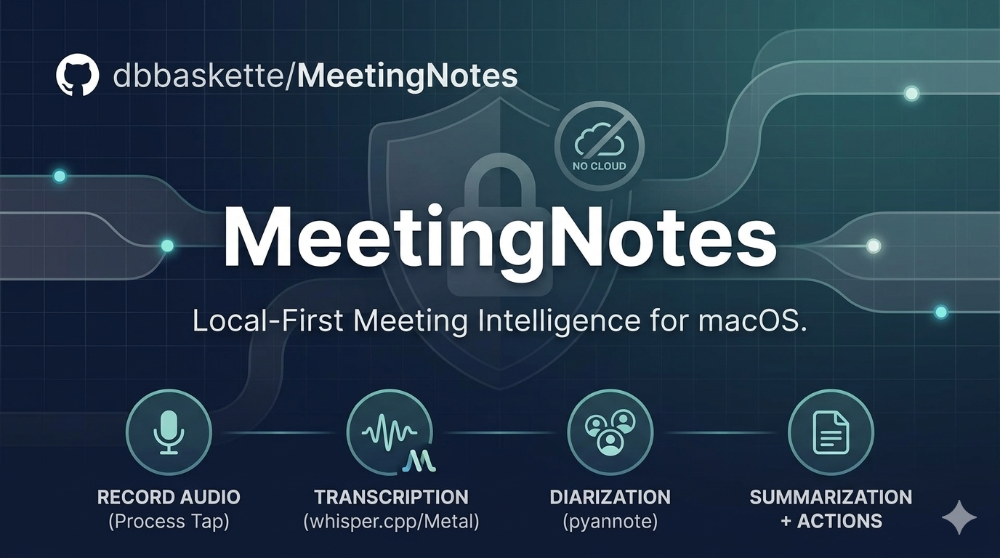
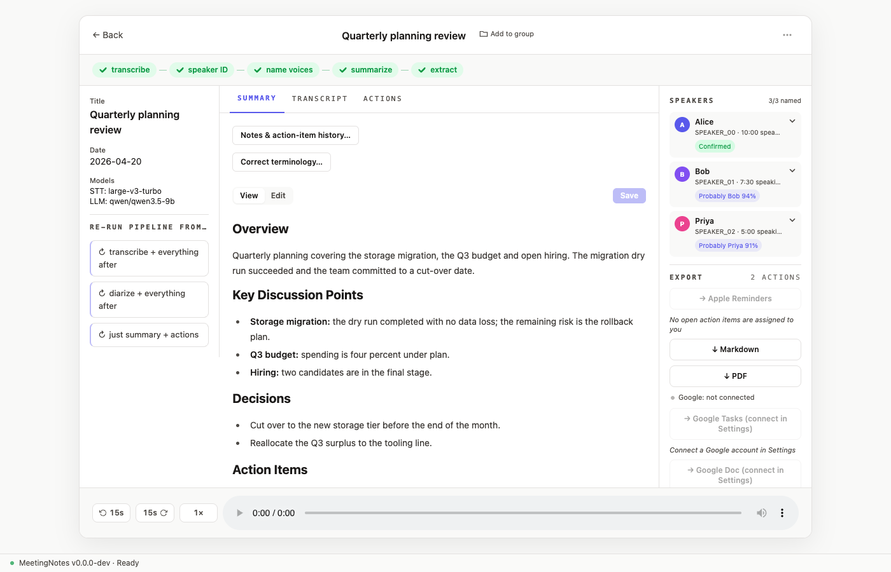
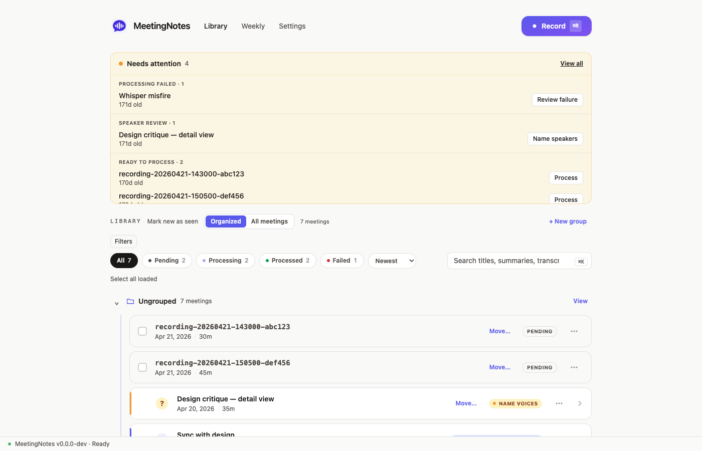
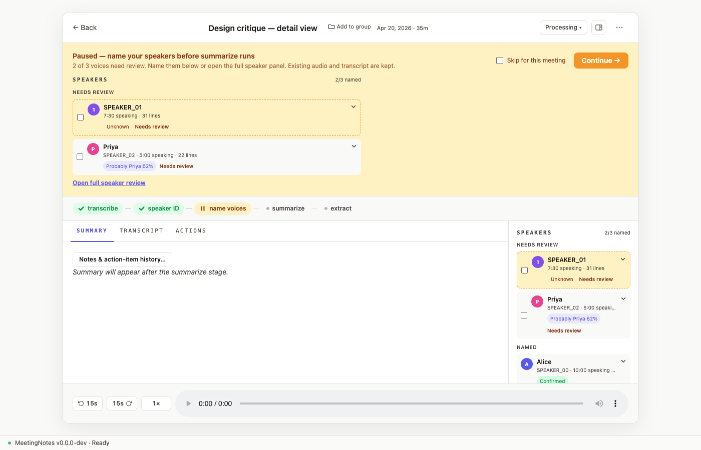
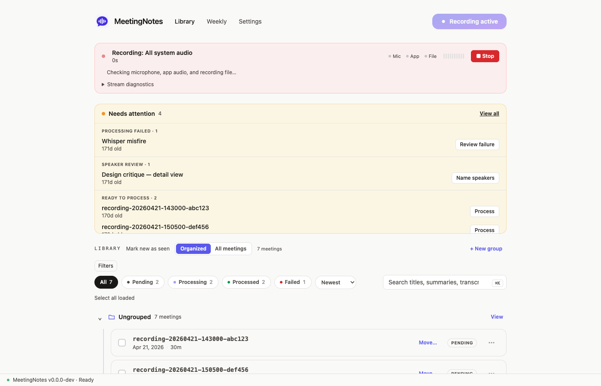
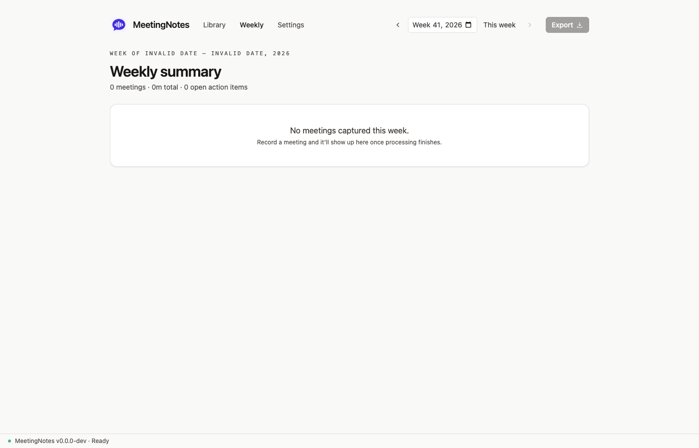
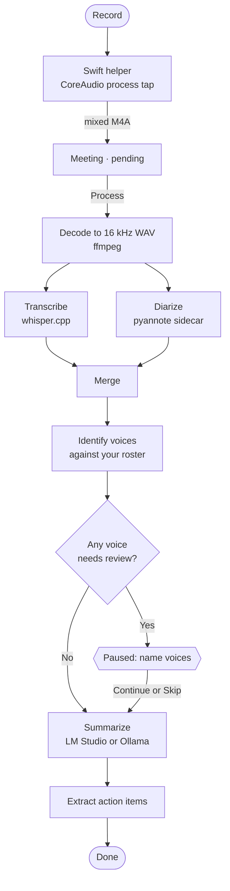

<div align="center">



<h1>MeetingNotes</h1>

<p><strong>Record a meeting on your Mac and get a transcript with named speakers, structured notes and action items, using models that run on your own machine.</strong></p>

[](https://support.apple.com/en-us/HT201260)
[](https://support.apple.com/en-us/HT211814)
[](docs/releases/v1.14.7.md)
[](https://www.electronjs.org/)
[](https://dbbaskette.github.io/MeetingNotes/)

</div>



## What you get

- **Capture without a virtual audio device.** One click records any app's audio (Zoom, Teams, FaceTime, a browser tab) mixed with your microphone, using the macOS 14.2 process tap.
- **A transcript with real names.** whisper.cpp transcribes, pyannote separates the voices, and voices you name once are recognised in later meetings.
- **Notes you can act on.** A local LLM writes an overview, discussion points, decisions and open questions, then extracts action items with owners and due dates. Each item links back to the line it came from.
- **A Library that stays organised.** Groups, search across titles, notes and transcripts, and a **Needs attention** panel for failed runs, voices to name and interrupted recordings.
- **A weekly roll-up.** Themes that ran across the week's meetings, decisions, and your open action items.
- **Exports when you want them.** Apple Reminders, Google Tasks, Google Docs, PDF, Markdown, an Obsidian vault, or a webhook.

| Library | Naming voices |
| :---: | :---: |
|  |  |
| **Recording** | **Weekly** |
|  |  |

## Install and first recording

**You need:** macOS 14.2 or later on Apple Silicon, about 16 GB of RAM, [LM Studio](https://lmstudio.ai) or [Ollama](https://ollama.com) with a chat model, and a free Hugging Face account (pyannote's models are gated; see [Models](docs/guide/models.md)).

MeetingNotes is built from source. There is no downloadable installer.

```bash
git clone https://github.com/dbbaskette/MeetingNotes.git
cd MeetingNotes
brew install whisper-cpp ffmpeg
./scripts/setup.sh      # dependencies, diarization sidecar, Whisper model, HF token, app build
./scripts/start.sh      # launch the app (add --dev for hot reload)
```

On first launch a setup wizard checks permissions, the Whisper model, the Hugging Face token and the LLM runtime. macOS asks for **Microphone** and **Screen & System Audio Recording** the first time you record.

1. Click **Record** and pick an app, or **All system audio**.
2. Click **Stop**, then confirm.
3. Open the recording and click **Process**. To skip this step, turn on **Process recordings automatically** in Settings → Processing.
4. If a voice is not recognised, name it and click **Continue**.
5. Read the notes. Edit them, check off action items, or export.

More detail: [Recording](docs/guide/recording.md) · [Working with meetings](docs/guide/meetings.md)

## How it works

MeetingNotes is an Electron app that runs four local helpers, starting each when needed and stopping it after ten idle minutes.


```mermaid
flowchart TD
    rec([Record]) --> tap["Swift helper<br/>CoreAudio process tap"]
    tap -->|mixed M4A| pending["Meeting · pending"]
    pending -->|Process| prep["Decode to 16 kHz WAV<br/>ffmpeg"]
    prep --> stt["Transcribe<br/>whisper.cpp"]
    prep --> dia["Diarize<br/>pyannote sidecar"]
    stt --> merge[Merge]
    dia --> merge
    merge --> id["Identify voices<br/>against your roster"]
    id --> review{"Any voice<br/>needs review?"}
    review -->|Yes| gate{{"Paused: name voices"}}
    review -->|No| sum["Summarize<br/>LM Studio or Ollama"]
    gate -->|Continue or Skip| sum
    sum --> ext["Extract action items"]
    ext --> done([Done])
```

Transcription and diarization run in parallel. Each meeting is one row in SQLite (`~/Documents/MeetingNotes/db.sqlite`) and one folder of plain files (`transcript.md`, `summary.md`, `action-items.json`) under `meetings/`. If the app quits mid-run, processing resumes on the next launch; a failed meeting waits for **Retry**, which restarts from the last completed stage.

## Integrations

| Target | What it does |
| --- | --- |
| **Apple Reminders** | Adds your action items to a Reminders list. |
| **Google Tasks / Docs** | Sends action items to Tasks, or the notes to a Doc. Uses your own OAuth client: [setup](docs/google-setup.md). |
| **Markdown / PDF** | Saves the notes as a file, with the action items you select. Generated locally. |
| **[Obsidian](docs/obsidian-sync.md)** | Keeps one Markdown note per finished meeting in a vault folder. One-way. |
| **[Webhook](docs/exporters.md)** | POSTs a `meeting.completed` payload to an HTTPS or localhost endpoint (n8n, Zapier, Slack, Telegram templates). |
| **[URL scheme](docs/url-scheme.md)** | `meetingnotes://record`, `…/stop`, `…/open` for Shortcuts, Stream Deck or scripts. |

## Privacy and security

**What stays on your Mac:** audio, transcripts, notes, the speaker roster and the database. With the default settings, transcription, diarization and summarization all run locally, and the app sends no telemetry and needs no account.

**What can leave, and only if you set it up:**

| You configure | What is sent | Where |
| --- | --- | --- |
| A remote transcription or LLM endpoint | The audio or text for that stage | That endpoint |
| Google Tasks or Docs export | The items or notes you export | Google |
| A webhook | The meeting payload, per the template and owner filter | Your URL |
| Obsidian sync | Notes written into your vault | Wherever the vault itself syncs |
| The Hugging Face token check and first model download | Your token | huggingface.co |

**How the app is hardened:**

- The window runs sandboxed with context isolation and no Node integration. It can only call a fixed API exposed by the preload.
- Every IPC call's arguments are checked against a schema before its handler runs ([`channel-schemas.ts`](electron/main/ipc/channel-schemas.ts)); a test fails if a channel has no schema.
- A Content-Security-Policy denies everything by default and allows only bundled scripts. Links in notes open in your browser and can never navigate the app window.
- The Google refresh token, Google client secret and webhook bearer token are encrypted with the macOS keychain and are never sent to the window. The Hugging Face token is stored in `~/.cache/huggingface/token` with mode 600.
- The `meetingnotes://` URL scheme is treated as untrusted input, and capture is limited to a signed helper that stops if the app exits.

## Documentation

- **Using it:** [Recording](docs/guide/recording.md) · [Working with meetings](docs/guide/meetings.md) · [Models](docs/guide/models.md) · [Settings and storage](docs/guide/settings.md)
- **Integrations:** [Exporters and webhooks](docs/exporters.md) · [Google setup](docs/google-setup.md) · [Obsidian sync](docs/obsidian-sync.md) · [URL scheme](docs/url-scheme.md)
- **Keeping it safe:** [Library backup and restore](docs/library-backup.md) · [Capture and processing reliability](docs/reliable-capture-processing.md)
- **Building it:** [Development and packaging](docs/guide/development.md) · [Local CI](docs/local-ci.md) · [Manual smoke test](docs/manual-smoke-test.md)
- **What changed:** [Release notes](docs/releases/)

Everything is indexed in [docs/README.md](docs/README.md).

## Development

```bash
npm run dev            # Vite + Electron with hot reload
npm test               # full suite, under Electron's Node (no native rebuild)
npm run lint           # whole repository, zero warnings
npm run smoke:source   # build, then launch against a synthetic library
npm run dist           # audio helper + sidecar + app -> .dmg and .zip in release/
```

CI runs locally in a disposable Tart macOS VM: `bash scripts/ci/tart-macos.sh --quick`. See [Local CI](docs/local-ci.md).

## License

MIT.

## Acknowledgements

- [whisper.cpp](https://github.com/ggerganov/whisper.cpp) for local Whisper inference
- [pyannote-audio](https://github.com/pyannote/pyannote-audio) for speaker diarization
- [LM Studio](https://lmstudio.ai) and [Ollama](https://ollama.com) for local LLM runtimes
- [AudioCap by @insidegui](https://github.com/insidegui/AudioCap), the process-tap reference that made capture possible
