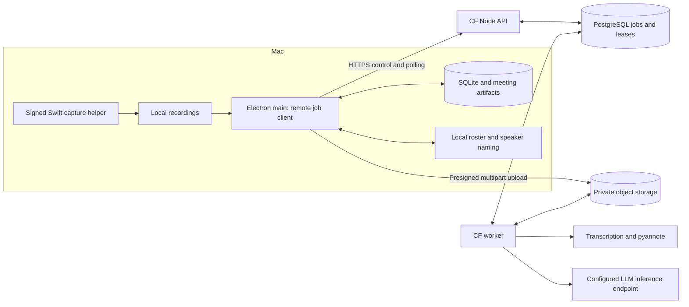

# MeetingNotes: local Mac capture with Cloud Foundry processing

Status: approved design history. An experimental runtime is implemented on `codex/cloud-processing-design`; deployment and Tanzu Platform qualification remain pending.
Date: 2026-09-08. Baseline: main at `6aeaaca`, MeetingNotes 1.12.0.
Branch: `codex/cloud-processing-design`.

## Product decision

Add an optional remote processing mode to the existing Mac app. Keep recording, playback, recovery, the Library, voice roster, speaker naming, editing, and exports on the Mac. Run the expensive transcription, diarization, summarization, and action-item extraction through a private service on Cloud Foundry in Tanzu Platform (TP).

Start with one owner and one authoritative Mac library. Authenticate the desktop client with a revocable API token. Remote processing is selected explicitly; the existing local mode remains available. Closing the Mac app does not cancel an accepted remote job. Recording remains available without a network connection.

This is an experiment on a separate branch. It is not a shared cloud Library, collaborative meeting service, or browser replacement for the desktop recorder.

## Approaches considered

| Approach | Benefit | Cost and decision |
| --- | --- | --- |
| Point current clients at remote inference endpoints | Smallest prototype | Local orchestration must remain running; current diarization sends a local file path and holds a long request open. Does not meet durable processing needs. |
| Durable remote jobs, desktop owns the Library | Processing survives app closure; preserves the existing UI and local data | Requires upload, job persistence, and result synchronization. Recommended. |
| Move the whole Library and workflow to a web service | Enables multiple clients and collaboration | Introduces identity, shared editing, cloud roster ownership, and data migration. Defer. |

## Component boundaries

- **Desktop:** capture, upload outbox, remote-job reconciliation, downloads, local roster matching, review gate, and artifact import. Credentials stay in macOS Keychain, outside the renderer and SQLite settings.
- **Node API:** authenticate, validate capabilities and requests, authorize object transfers, create durable jobs, expose status/results, and accept cancellation/deletion. It never waits for model inference in an HTTP request.
- **Worker:** claims persisted work and writes immutable stage outputs. Reuses extracted TypeScript prompt/merge/validation logic and Linux-compatible Python diarization code. It cannot depend on Electron or Mac filesystem paths.
- **PostgreSQL:** job state, stages, attempts, ownership, idempotency records, leases, result manifests, cleanup state.
- **Object storage:** uploaded audio, intermediate artifacts and versioned results. Container disk is temporary workspace only.
- **Inference:** first validate CPU transcription/pyannote on the target foundation. Summarization uses an explicitly configured, server-reachable LLM endpoint. GPU-backed endpoints are an adapter option after verifying availability; GPU capacity is not assumed on TP.

The existing `/diarize` endpoint is a trusted localhost interface accepting `audio_path`. Do not expose it publicly. A worker resolves an authorized object into its own workspace and invokes diarization there.

## End-to-end workflow

1. The Mac records using the existing helper and finalizes the recording locally. Recovery and trimming finish before uploading. Upload only the selected mixed recording or recovered copy; voice/system stems stay local by default.
2. Process snapshots a processing mode, source digest, model profile, settings, and local artifact revision into a durable local outbox entry. A settings change affects future submissions, not an existing run.
3. Create a remote audio-analysis job using a persistent idempotency key. Upload the compressed source directly to private object storage in bounded multipart chunks. Persist upload ID and confirmed parts locally; reconcile with the service after restart.
4. Finalize the upload. The service verifies the object, bytes and SHA-256 before the job becomes runnable. A completion request that times out is reconciled using the same key/job ID.
5. A worker decodes once to 16 kHz audio, transcribes, diarizes, and generates an immutable result manifest. Begin with one audio job per worker and sequential inference to cap memory; parallel inference is a later measured optimization.
6. The Mac polls status and downloads validated transcript/diarization artifacts. Local matching uses the existing voice roster. Review and naming run in the existing speaker UI, including the skip option.
7. Continue creates a separate text-generation job from an immutable snapshot of the labeled transcript and summary settings. The server summarizes and extracts action items. No long-lived worker waits while the user names speakers.
8. The Mac validates and imports the output, updates local SQLite and artifact caches, and acknowledges the result. Existing exports execute locally once per imported generation.

Audio analysis can finish with the Mac offline. Text generation begins after the Mac has completed naming or explicitly skipped it. Weekly recaps and other auxiliary LLM features remain local in this first iteration; a later text-job extension can move them remotely.

## Ownership and compatibility

The Mac remains authoritative for meeting IDs, edits, roster links and exports. The server owns execution state and immutable output for each remote run. Jobs reference an opaque client meeting ID plus run ID, never a slug or local path. This does not provide multi-device sync.

Add a processing backend boundary above expensive stages: `LocalProcessingBackend` and `RemoteProcessingBackend`. The remote path uses a durable desktop coordinator; it must not hold the existing serial `Pipeline` queue while polling a remote job. Keep local pipeline behavior and recovery tests intact. Persist remote mappings separately from existing stage values and expose a combined UI status projection.

Suggested local metadata: endpoint identity, owner identity, client run ID, remote job IDs, input digest, processing profile digest, transfer checkpoints, result revision, expected local revision, last observed server revision, retry state, and imported manifest digest. Secrets are never included.

Add an explicit embedding identity (model repository/revision, preprocessing version, dimension, normalization) to roster and result metadata. Existing roster vectors are legacy/unknown unless their provenance is verified; equal dimensions alone do not establish compatibility. Incompatible vectors require manual naming or an explicit re-enrollment flow, never an automatic match. Invalid, zero or non-finite embeddings produce an unknown speaker with a warning instead of failing the whole meeting.

## Service contract

All authenticated resources live under `/v1`. Public liveness returns no meeting or model details. Authenticated capabilities report schema versions, model profiles, upload limits and retention defaults. Client and server validate request and response schemas independently.

| Endpoint | Contract |
| --- | --- |
| `GET /v1/capabilities` | Compatible schemas, profiles, limits, service identity |
| `POST /v1/jobs` | Create `audio_analysis` or `text_generation`; return 202 and job URL |
| `GET /v1/jobs/:id` | State, phase, revision, safe error, timestamps, result availability |
| `POST /v1/jobs/:id/upload-parts` | Mint short-lived URLs for specified parts of that job's upload |
| `GET /v1/jobs/:id/upload` | Confirmed parts and upload session state |
| `POST /v1/jobs/:id/upload-completion` | Idempotently verify and finalize upload |
| `GET /v1/jobs/:id/result` | Versioned manifest and authorized artifact download URLs |
| `POST /v1/jobs/:id/acknowledgements` | Record successful client import for a manifest digest |
| `POST /v1/jobs/:id/cancellation` | Request cancellation; returns current state |
| `DELETE /v1/jobs/:id` | Tombstone and asynchronously remove owned objects |

Mutating requests use a client-generated idempotency key persisted before sending. PostgreSQL enforces uniqueness by owner, operation and key. Reusing a key with different content returns 409; a duplicate in progress returns the existing job/status. Object-transfer URLs are restricted to the authorized object and operation, expire after 15 minutes, and can be renewed. An expired URL never requires creating another job.

Errors use `{error: {code, message, retryable, requestId}}`; 401/403 mean credential/ownership problems, 409 a revision or intent conflict, 413 a size limit, 422 invalid content, 429 capacity limits, and 503 temporary service unavailability. Respect `Retry-After`. Do not return stack traces, credentials or local paths.

Proposed initial limits, configurable downward per foundation: 1 GiB source file, 8-hour decoded duration, 16 MiB upload parts, two concurrent part uploads, 10 queued jobs per owner, and one running audio job per worker. Text jobs upload a bounded object rather than a large API body. Context-window limits are checked before inference; oversized transcripts return a clear error for trimming or local processing until a tested chunking strategy exists.

## Durable jobs and recovery

State sequence: `uploading -> queued -> running -> succeeded | failed | cancelled`, with `cancel_requested` recorded separately until the worker stops. Text jobs begin at queued after their input snapshot is validated. Expose named phases rather than fabricated progress percentages.

Workers atomically claim rows with PostgreSQL locking, obtain a lease generation, heartbeat every 15 seconds, and renew a 120-second lease. All stage completion writes require the active generation. Outputs use attempt-specific object keys; only a fenced database commit publishes their manifest. Lost leases can cause repeated computation, but stale workers cannot publish results.

Store successful stages and their input/profile digests. Retry only stages whose valid outputs are absent. Bound automatic transient retries to three attempts with exponential backoff; permanent media or configuration failures await explicit user retry. A retry creates a new execution attempt under the same user intent. A deliberately changed input/settings snapshot creates a new run.

On worker shutdown, stop claiming jobs and checkpoint or release ownership where possible. If termination interrupts inference, lease expiry recovers it. Cancellation stops subprocesses and fences later publication; external inference requests may finish or incur cost even after cancellation, but their outputs cannot become active results.

The Mac reconciles unfinished runs at launch and when connectivity returns. Poll active jobs every 5 seconds, backing off to 60 seconds on connection failure. Show disconnected/last-updated status while preserving server state. Never silently switch a submitted job to local processing: Process locally first cancels/fences the remote run and creates a new local generation.

## Safe result import

Each manifest specifies job/run IDs, schema and profile versions, artifact sizes and hashes. Download to a staging directory, verify hashes and schemas, and reject paths or executable content supplied by the server. Validate segment timestamps, embeddings, action-item schema, and bounded output sizes.

Publish artifacts into an immutable local generation directory, then transactionally update the database pointer/import record. Reads use the active generation. A crash before pointer commit leaves an orphan staging/generation directory; a crash afterward retains a complete published generation. Cache invalidation and export notifications follow the committed import and are recoverable/idempotent. This avoids pretending filesystem renames and SQLite commits form one transaction.

Compare the current local revision with the submission revision. User edits, renamed speakers, reruns or deletion fence stale results. Keep conflicting output as an available revision with an explicit review action; never overwrite edits automatically. Preserve manual speaker assignments when refreshing compatible analysis artifacts.

## Security and retention

Use TLS and one high-entropy revocable token mapped to a stable owner. Server storage holds token hashes; client credentials use Keychain. Rotation allows a brief two-token overlap. Every lookup and presigned URL is owner-scoped even for the single-user deployment. Inference/object-store credentials exist only on the server through service bindings or the platform's secret mechanism.

The first remote submission explains that audio and labeled transcript content will be uploaded to the configured service; generated transcripts, embeddings, summaries and action items are downloaded from it. Names enter the service only in the labeled transcript for text generation. The local voice roster is never uploaded. User-selected remote mode is the authorization to upload subsequent jobs under that configuration.

Retention defaults: abandoned multipart uploads expire after 24 hours; acknowledged audio jobs remove source/intermediate media within 24 hours; unacknowledged results and their required source data remain for 30 days after completion. Text-job inputs follow the same rule. A cleanup worker retries failed deletion; tombstoned jobs cannot be downloaded or republished. Retain content-free idempotency tombstones for 90 days; after expiry the client must request explicit reprocessing rather than silently creating a replacement. Bucket lifecycle rules are a backstop aligned with these periods. Document infrastructure backup retention separately before deployment.

Logs contain job IDs, phases, durations, byte counts and error codes, never audio, transcripts, speaker names, tokens or signed URLs. Metrics cover queue age, processing time per audio hour, retries, lease expiry, upload failures, memory and cleanup backlog.

## Cloud Foundry deployment

Use separate API and worker process types. Bind PostgreSQL and a private S3-compatible object service; the desktop must be able to reach the object endpoint over HTTPS for direct uploads. API health checks use HTTP; non-listening workers use process health checks plus application lease/heartbeat monitoring. Bind API listeners to the platform's assigned `PORT`.

Package the worker for the foundation's Linux architecture. Do not deploy the macOS PyInstaller bundle or assume Apple MPS acceleration. Use a supported image deployment if enabled on this foundation; otherwise build a Linux artifact using approved buildpacks. Pin Python, torch, pyannote, transcription models and ffmpeg versions. Download licensed model assets during controlled staging or startup to scratch storage; verify licensing, egress, startup timing and resource limits before deployment.

Starting resource hypotheses for measurement: API 512 MiB–1 GiB memory, one API instance; worker 8 GiB memory and 10 GiB scratch, one worker instance. These are not deployment requirements or performance promises. Decoding a multi-hour recording and loading model weights can exceed them; enforce admission limits based on measured peak RSS/disk before accepting the maximum duration.

TP validation must establish the actual foundation, org/space, buildpack/image support, memory/disk quotas, CPU allocation, model-service options, inference reachability, PostgreSQL/object-store offerings and upload connectivity. No foundation has been inspected or selected for this design. Any future CF command must first select the intended context with the repository's `cf-context` workflow.

## Desktop experience and browser option

Settings adds Processing location: On this Mac / Remote server, server URL, token setup, Test connection, and capabilities/model profile display. Each meeting retains its selected mode. Remote mode skips local model setup requirements for the supported meeting-processing flow.

Rows display Uploading (bytes), Queued, Transcribing, Diarizing, Needs speaker names, Summarizing, Downloading, or Done. Offline recordings remain Pending upload and resume automatically when the user already requested processing. Errors offer the appropriate Retry upload, Reconnect, Retry processing or Process locally action.

Browser microphone recording and user-selected screen/tab audio are possible, but source availability depends on the browser and OS. `getDisplayMedia` audio options are hints, not a guarantee of a track. A web client cannot directly invoke the current Swift helper without a separately secured native bridge. Defer that bridge and browser capture to their own compatibility and permission design. A later browser client can first support file upload and job review.

## Delivery and acceptance

1. **Platform feasibility:** synthetic 5-minute, 60-minute and multi-hour fixtures on the target Linux runtime. Measure processing time, peak memory/disk, model load time and embedding compatibility. Confirm service/storage connectivity. This determines deployable profiles and maximum duration.
2. **Service foundation:** authenticated API, PostgreSQL jobs/leases, multipart upload, worker restart/cancellation, retention and result manifests using deterministic test processors.
3. **Remote audio analysis:** actual transcription/diarization, checksummed imports, local roster matching and speaker gate. Test cold starts and incompatible embeddings.
4. **Remote text generation:** labeled transcript snapshots, shared prompts/output validation, summary/action-item import, edit-conflict handling.
5. **Desktop integration and hardening:** settings, upload resumption, live statuses, offline reconciliation, local fallback, packaging and documentation.

Acceptance requires a full remote meeting run with no local inference process; recording during network loss; upload recovery after app termination; completion while the Mac sleeps; worker/API restart without lost jobs or duplicate publication; stale worker fencing; zero-vector handling; matching speaker model provenance; edits/deletion protected from late results; resumable downloads and crash-safe import; authentication/ownership rejection; cleanup and token rotation; and unchanged local processing behavior.

Test the service contracts and local/remote adapters with shared fixtures. Use real PostgreSQL and object storage in integration tests for claim races, multipart completion and cleanup. Perform one TP deployment smoke with synthetic audio before testing an explicitly selected real recording. Compare result quality and performance against the local baseline; remote is not presumed faster.

## Source references and assumptions

- Repository seams inspected: `electron/main/pipeline/pipeline.ts`, `context.ts`, `stages/identifying.ts`, `stages/summarizing.ts`, `electron/main/diarization/client.ts`, and `sidecar/meeting_notes_diarize/diarize.py`.
- Cloud Foundry storage behavior: https://docs.cloudfoundry.org/devguide/deploy-apps/prepare-to-deploy.html
- Cloud Foundry process and health-check configuration: https://docs.cloudfoundry.org/devguide/deploy-apps/manifest-attributes.html
- Browser capture behavior and limitations: https://developer.mozilla.org/en-US/docs/Web/API/MediaDevices/getDisplayMedia

The CF durability and process decisions follow the official documentation; the browser conclusion follows MDN's documented source variability. Limits, resource sizing, retention, polling and technology choices elsewhere in this document are proposed design decisions, not claims about the user's TP installation.
